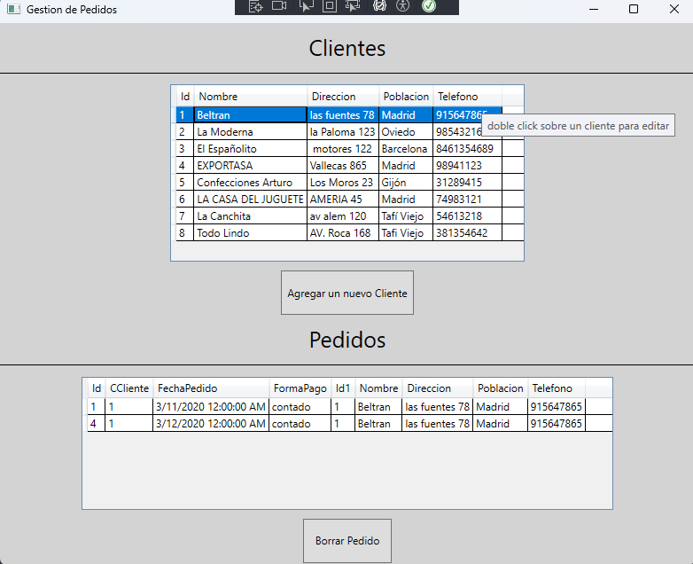
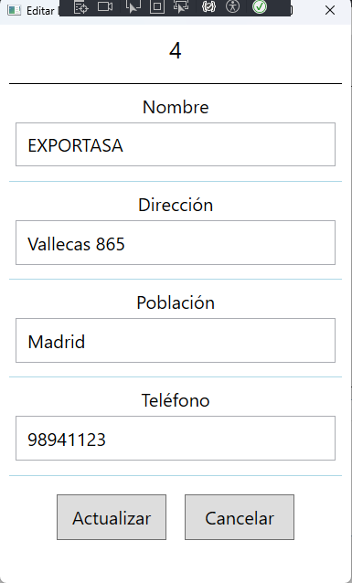

# GestionDePedidos

## Proyecto CRUD Sencillo con WPF, .NET 8 y ADO.NET

Este proyecto es una aplicación CRUD (Crear, Leer, Actualizar, Eliminar) sencilla desarrollada con WPF (Windows Presentation Foundation), .NET 8 y ADO.NET para interactuar con una base de datos SQL Server.

### Características

* Interfaz de usuario intuitiva con WPF para gestionar datos.
* Conexión a una base de datos SQL Server utilizando ADO.NET.
* Operaciones CRUD básicas:
    * **Crear:** Agregar nuevos registros a la base de datos.
    * **Leer:** Mostrar los registros existentes en una lista o tabla.
    * **Actualizar:** Modificar los datos de un registro existente.
    * **Eliminar:** Eliminar un registro de la base de datos.

### Capturas de pantalla

*Pantalla principal de la aplicación mostrando la lista de registros.*

*Formulario para editar los datos de un registro.*

### Requisitos

* .NET 8 SDK
* SQL Server
* Visual Studio o un editor de código compatible con WPF

### Instrucciones de ejecución

1. Clonar el repositorio
2. Abrir la solución en Visual Studio.
3. Configurar la cadena de conexión a la base de datos SQL Server en el archivo `App.config`.
4. Compilar y ejecutar la aplicación.